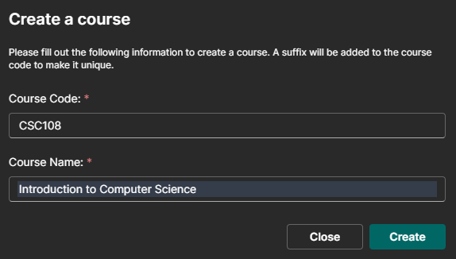
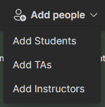
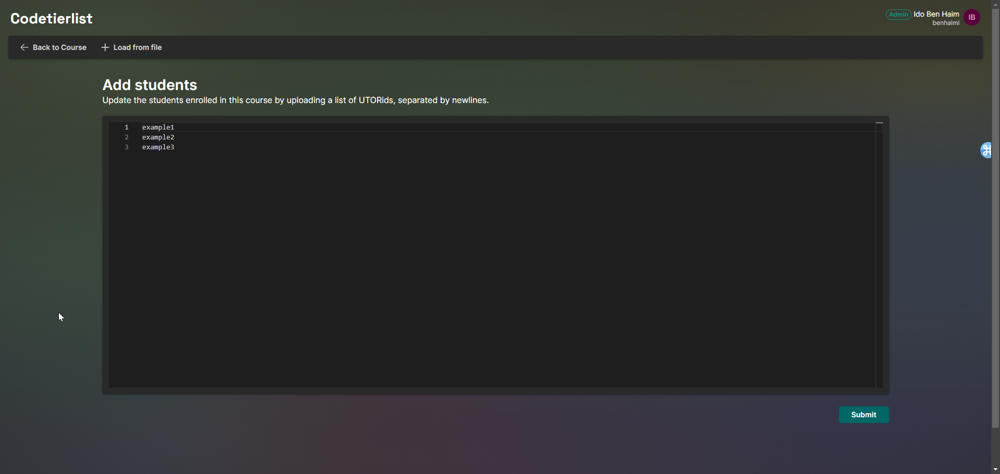
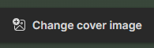
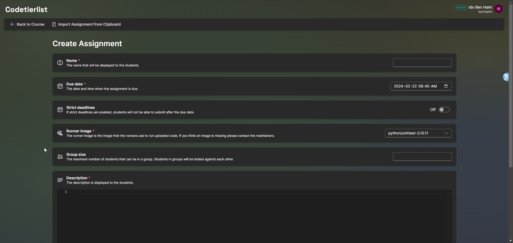
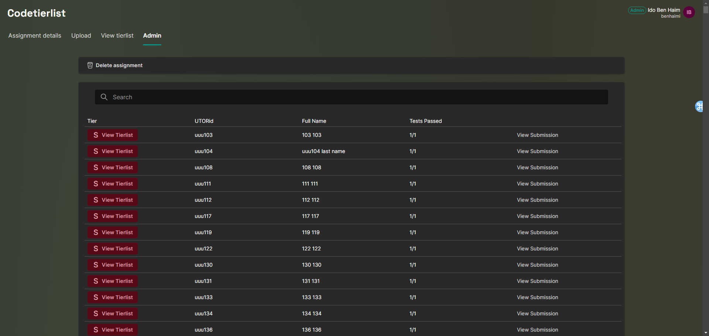

# Codetierlist Instructor Quickstart Guide
This guide will help you get started with the Codetierlist as an instructor.
## Table of Contents
- [What is Codetierlist?](#what-is-codetierlist)
- [Getting Started](#getting-started)
- [Permissions](#permissions)
  - [Student](#student)
  - [Instructors and TAs](#instructor-and-tas)
  - [Admin](#admin)
- [Creating a Course](#creating-a-course)
  - [Enrollment](#enrollment)
  - [Removing People](#removing-people)
  - [Cover Image](#cover-image)
  - [Course Deletion](#course-deletion)
- [Creating an Assignment](#creating-a-lesson)
  - [Runners](#runners)
  - [Due Dates](#due-dates)
  - [Grouping](#grouping)
  - [Admin Solutions](#admin-solutions)
  - [The Admin Panel](#the-admin-panel)
  - [Tierlist](#tierlist)
- [Contact and Support](#contact-and-support)

## What is Codetierlist?
Ever wondered when you complete an assignment and do not know how well you're doing compared to other students? Introducing the Codetierlist!

We provide to give users(students) an opportunity as the leading place to test your code for students to know their progress compared to their peers while they are working on their assignments, making coding more interactive, fun, and easier.

On Codetierlist, instructors can create new projects (assignments) for students. In each project, students are able to upload their own test cases and code, how well students do will be based on the accuracy of the students code in their own test cases, this will be shown in a tier list for students to see.

## Getting Started
To get started go to https://codetierlist.utm.utoronto.ca/ and sign in with your UofT credentials. Once you are signed in, you will be able to see the courses you are enrolled in.

## Permissions
There are four types of roles in Codetierlist: Admin, Instructor, TA, and Student. Each role has different permissions and capabilities.
### Student
A student can only view the courses they are enrolled in and submit code and testcases for assignments.
They can also view the anonymized tier list for each assignment.
### Instructor and TAs
Instructors and TAs have to be enrolled in a course to view it. They can create and manage assignments, view the de-anonymized tier list, and view every student's submissions, testcases, and tier for each assignment. They can also submit the instructor's solution for each assignment.
### Admin
Admins have the same permissions as instructors and TAs, but they can also create and manage courses and view every course and assignment on the platform. They can also delete any courses and assignments regardless of whether they are enrolled in it or not.
Note that the admins are not able to submit the instructor's solution for an assignment unless they are an instructor/TA for the course.

## Creating a Course
To create a course, click on the plus button on the home page (note that only [admins](#admin) can create courses). You will be prompted to enter the course code, course name, and a cover image. Once you have entered the information, click "Create Course" to create the course. You will be automatically enrolled in the course as an instructor when you create it.
After creating the course, you can click on the course to view the course page.

### Enrollment
To enroll people in the course, click on the "Add people" button on the course page. 
You will then be prompted to select the role of the people. Select "Add Instructors" to enroll instructors, "Add TAs" to enroll TAs, and "Add Students" to enroll students (see [permissions](#permissions)).

After choosing the appropriate role, you will be prompted to enter the UTORids of the people you want to enroll. You can enter multiple UTORids by putting each utorid in a separate line. Click "Submit" to enroll the people in the course.
You can also enroll people from a CSV file by clicking on the "Load from File" button and uploading the CSV file. The CSV file should have a single column with the header "UTORid" and the UTORids of the people you want to enroll in the course.

### Removing People
Similar to [enrolling people](#enrollment); to remove people from the course, click on the "Remove people" button on the course page. You will then be prompted to enter the UTORids of the people you want to remove. You can enter multiple UTORids by putting each utorid in a separate line. Click "Submit" to remove the people from the course.
You can also remove people from a CSV file by clicking on the "Load from File" button and uploading the CSV file. The CSV file should have a single column with the header "UTORid" and the UTORids of the people you want to remove from the course.

### Cover Image
To change the cover image of the course, click on the "Change Cover Image" button on the course page. You will then be prompted to upload a new cover image. Note that the change will be reflected immediately after the file's upload.

### Course Deletion
To delete the course, click on the "Delete Course" button on the course page. You will be prompted to confirm the deletion.

## Creating an Assignment
To create an assignment, click on the "Add assignment" button on the course page. You will be prompted to enter the assignment's details. Once you have entered the information, click "Create Assignment" to create the assignment.
**Note that assignment names must be unique within a course.**

### Runners
You can select the runner you want to use for the assignment. The runner is the script that will run the students' testcases against their code. You can only select one runner for an assignment.
The available runners are listed in `backend_config.json` and can be added on request (see [Contact and Support](#contact-and-support)).

### Due Dates
By default, due dates don't mean much and are only displayed to students for infomation. However, if you want to use the due dates to enforce the due date, you can enable the "Strict deadlines" option. Once enabled, students cannot submit after the deadline.

### Grouping
You can group student's into tier list groups. This makes sure the students are only compared to other students in the same group. This makes the tier list more fun and less "grade like" as students will only be competing with a handful of other students. 

Another reason to use grouping is to make sure submissions are processed faster. If you have a large class, it might take a long time to process all the submissions (as every submission will have to be individually run against 1000 testcases in a course of 1000 students). By grouping students, you can ensure that every submission is only run against a maximum of N testcases (where N is the group size).

### Admin Solutions
You can submit the instructor's solution for the assignment. The instructor's solution is used to validate the students' testcases. If the instructor's solution is not submitted, the students' testcases will not be validated which might cause wrong tier list results.

Any instructor or TA can submit the instructor's solution for the assignment. To submit the instructor's solution, click on the "Upload a Solution" button on the assignment page (under the "upload" tab). You will be prompted to upload the instructor's solution. 

*Note that uploading the instructor's solution will overwrite any previously submitted instructor's solution.*

After updating the instructor's solution, every testcase will be revalidated using the new solution to make sure the tier list shows the latest results.

### The Admin Panel
The admin panel is a special feature that allows instructors and TAs to view every student's submissions, testcases, and tier for an assignment. To access the admin panel, click on the "Admin" tab on the assignment page. You will be able to view the submissions, testcases, and tier for each student.

To view the de-anonymized tier list for a student click the tier next to the student's name. This will show the student's group tier list.

To view the student's submission and testcases, click on the "View Submission" button next to the student's name. You will be able to view the student's submission and testcases but not update it.

### Tierlist
The tier list is a list of students in the course ranked by their performance in the assignment. The tier list is anonymized by default, but instructors and TAs can view the de-anonymized tier list in the admin panel. The tier list is updated every time a student submits a new testcase or code.

The tier list is divided into tiers from S to F. The tier list is normalized so that most students are in the C-B tier (slightly-above mean is B, slightly-below mean is C). The tier list is grouped by the grouping you set in the assignment.

## Contact and Support
If you have any questions or need support, please contact any of the following people:
- Ido Ben Haim ([ido.benhaim@mail.utoronto.ca](mailto:ido.benhaim@mail.utoronto.ca))
- Daksh Malhotra ([d.malhotra@utoronto.ca](mailto:d.malhotra@utoronto.ca))
- Jackson Lee ([jacks.lee@utoronto.ca](mailto:jacks.lee@utoronto.ca))
